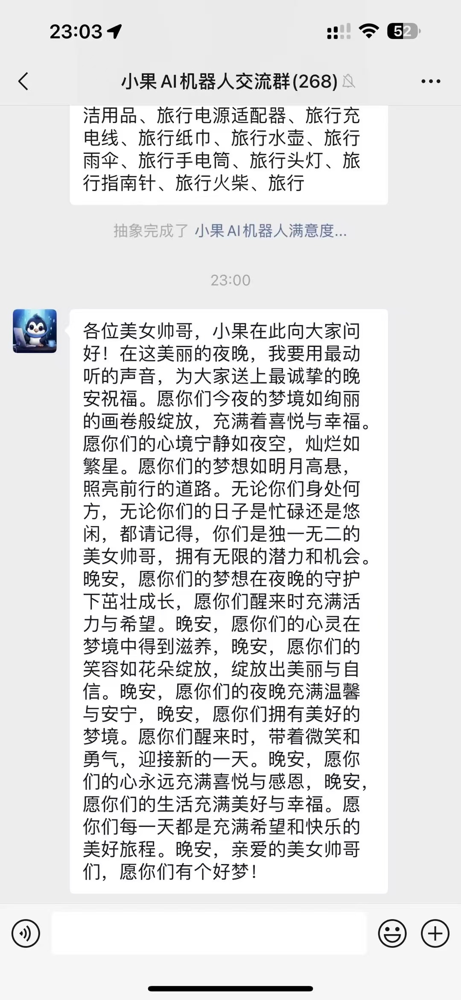

<h1 align="center">欢迎使用&nbsp;&nbsp;小果AI机器人 👋</h1>

  
  

> 微信机器人，ChatGPT机器人，AI智能助手，AI绘画机器人，Midjourney绘画，视频去水印，抖音快手视频无水印下载，群聊管理机器人，智能客服机器人，自动回复机器人，优惠券查询机器人，拼多多优惠券机器人，美团饿了么外卖红包，智能文档对话，全网热点资讯，全网热榜，私域运营助手，社群管理工具，电商营销机器人🔮🤖🚀

## 🏠 [Homepage](https://github.com/pen9un/xiaoguo-wechat-bot)

小果AI机器人是一款集成多种顶尖AI能力的智能微信助手，基于插件化架构和多模型融合技术，为个人用户和群聊提供全方位的智能服务。

## 🚀 使用说明

**微信交流群**（进群免费使用，如群二维码失效请加微信 **OceanYoo** ，需备注 **小果AI机器人**）：

## 🌟 特色优势

### 🔥 多模型AI融合
- **多模型支持**：集成国内外多个顶级AI模型
- **场景适配**：不同场景下使用适合的AI模型
- **能力互补**：多模型优势互补，提供更好的服务体验

### 🚀 专业文档分析
- **多格式支持**：PDF、Word、Excel、TXT等多种文档格式
- **深度解析**：文档结构化分析，智能段落提取
- **上下文理解**：保持文档对话上下文，实现连续对话
- **长文本处理**：支持超长文档智能拆分和分析

### 💡 智能交互体验
- **自然语言理解**：支持多轮对话，上下文记忆
- **多模态输入**：文本、图片、文档、链接等多种输入方式
- **场景感知**：根据对话场景智能调整回复策略
- **个性化响应**：根据用户习惯优化交互体验

## 🌟 主要功能

### 🤖 AI对话（智能对话、网址对话、文档对话）
- **智能对话**：基于多模型融合的智能对话系统
- **网址解析**：一键提取网页核心内容，智能总结要点
- **文档问答**：专业文档解析引擎，精准回答文档相关问题
- **长文本理解**：支持超长文本分析，保持上下文连贯性

### 🎨 AI创作（Midjourney绘画、中文AI绘画等）
- **智能绘画**：多引擎支持，包括Midjourney等顶级AI绘画模型
- **风格调整**：支持细粒度的风格控制和图片增强
- **提示词优化**：智能优化提示词，提升生成质量

### 📱 媒体工具
- **全平台支持**：覆盖抖音、快手、火山等主流平台
- **无水印下载**：高质量视频提取，保持原画质
- **智能处理**：自动优化视频大小，确保分享体验

### 🛍️ 购物优惠（拼多多优惠券、美团饿了么外卖红包）
- **拼多多优惠券**：自动匹配商品最优惠券
- **外卖红包**：美团、饿了么外卖优惠券
- **优惠推送**：定时推送特惠信息

### 📰 资讯服务（全网实时热榜）
- **全网热榜**：实时获取热门新闻资讯
- **智能总结**：新闻内容智能提炼
- **定时推送**：每日定时推送热点资讯

### 👥 群管理
- **智能欢迎**：新成员个性化欢迎语
- **自动管理**：自动处理加群请求
- **群规执行**：智能群规提醒
- **定时问候**：早安晚安定时问候

## 🔮效果展示

## 🤖 AI对话（定时问候）

 

### 🤖 文档对话 & 网址对话

B站视频链接：https://www.bilibili.com/video/BV1JWwHe9EcE/

### 🎨 AI绘画

**Midjourney AI 绘画：**

  

**中文 AI 绘画：**

B站视频链接：https://www.bilibili.com/video/BV1dLwsedEzt/

### 🛍️ 拼多多优惠券

### 📰 全网热榜

## 🔧 技术架构

### 💪 核心引擎
- **插件化架构**：功能模块化，支持动态加载
- **多线程并发**：高效的任务处理机制
- **实时通信**：基于WebSocket的消息处理
- **定时任务**：支持多样化的定时任务

### 🛡️ 稳定性保障
- **异常处理**：完善的异常捕获和处理机制
- **资源管理**：合理的资源分配和释放
- **状态监控**：系统运行状态监控
- **自动重连**：网络异常自动重连

### 🔄 定时服务
- **定时问候**：早安晚安定时问候
- **优惠推送**：定时推送优惠信息
- **热点推送**：定时推送热点资讯

## 🎯 应用场景

### 💼 个人助理
- 智能对话问答
- 文档内容解析
- AI图片创作
- 优惠信息获取

### 👥 群组管理
- 智能群聊管理
- 群活动组织
- 群规则执行
- 群氛围营造

### 🏢 私域社群
- 新成员引导
- 群组内容管理
- 活动策划组织
- 成员互动促进
- 社群氛围营造
- 违规内容监控

### 🛍️ 电商运营
- 商品信息推广
- 优惠券分发
- 团购活动组织
- 售前咨询解答
- 订单状态跟踪
- 客户服务支持

### 📚 教育培训
- 课程内容解答
- 资料快速提取
- 作业辅导批改
- 学习计划制定
- 知识库管理
- 在线答疑解惑

### 📣 营销推广
- 活动信息推送
- 产品介绍生成
- 营销文案创作
- 素材智能制作
- 用户互动管理
- 效果数据分析

### 💁 客户服务
- 7x24小时在线
- 智能问题解答
- 多轮对话支持
- 服务质量监控
- 用户反馈处理
- 工单自动分配

### 🏢 办公协助
- 会议纪要整理
- 文档智能分析
- 数据报表生成
- 日程任务提醒
- 工作流程优化
- 团队协作支持

---

*注：具体功能可能会根据实际运营情况调整，请以实际使用为准。* 

## 🌈 更多产品

### 📲 [DYSYS自媒体系统](https://github.com/pen9un/douyin-chatgpt-bot)

DYSYS自媒体系统是一款专业的抖音账号运营管理平台，集成AI自动回复、智能引流、内容管理等功能，为抖音创作者和企业提供一站式运营解决方案。

- **智能对话**：ChatGPT自动回复、评论互动、私信对话
- **账号托管**：短信授权、扫码授权、多账号管理
- **视频管理**：无水印下载、批量管理、内容审核
- **引流获客**：智能引流、用户互动、私域转化
- **企业客服**：话术配置、知识库对接、角色定制
- **数据分析**：互动数据、转化数据、效果分析

### 👩‍💻 [AIAST智能客服系统](https://github.com/pen9un/aiast-sys)

AIAST智能客服系统是新一代企业级智能客服解决方案，基于企业知识库和多模型AI技术，为企业提供专业的智能客服和知识管理服务。

- **知识库管理**：企业话术、文档解析、智能建库
- **多模型融合**：ChatGPT对话、知识库问答、混合增强
- **企业级部署**：多商户模式、权限管理、安全可控
- **开放集成**：API接口、多渠道接入、系统对接
- **数据分析**：对话记录、使用统计、效果评估
- **场景定制**：行业模板、角色定制、个性化配置

## 📖更新日志

- 2025-01-20 上线 Github
- 2017-01-01 系统诞生

## 🤝作者

👤 **pen9un**

* Website: https://github.com/pen9un/
* Github: [@pen9un](https://github.com/pen9un)

## ❤️支持

如果觉得此项目有用，请点一个免费的小 ⭐️⭐️

## ✨Star History

## 💹 访问量统计

